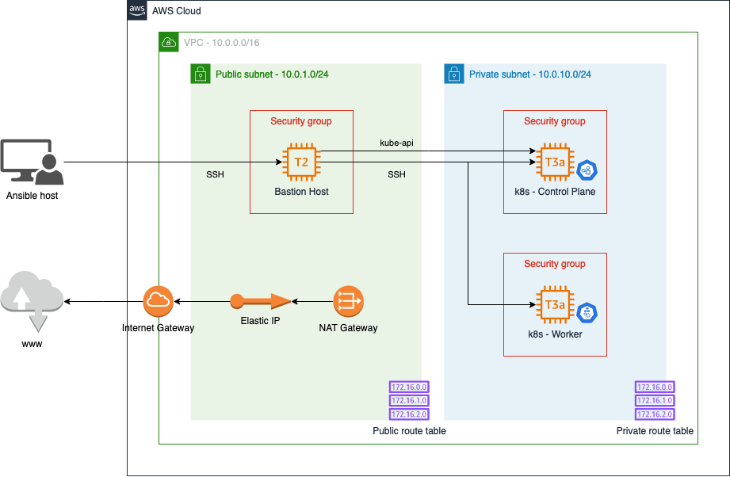

# Kubernetes infrastructure

This Terraform project deploys the infrastructure for a minimal Kubernetes
cluster, consisting of a bastion host, a Kubernetes control plane and a
Kubernetes worker.

## Architecture

The following diagram shows the architecture of the infrastructure deployed.



## Getting started

Before deploying the infrastructure, you need to generate the appropriate SSH
keys. In the current directory, run:

```bash
ssh-keygen -f bastion_host_key
ssh-keygen -f k8s_key
```

## Instructions

To deploy the infrastructure, run:

```bash
terraform apply
```

To increase the number of worker nodes to two, run:

```bash
terraform apply --var worker_count=2
```
